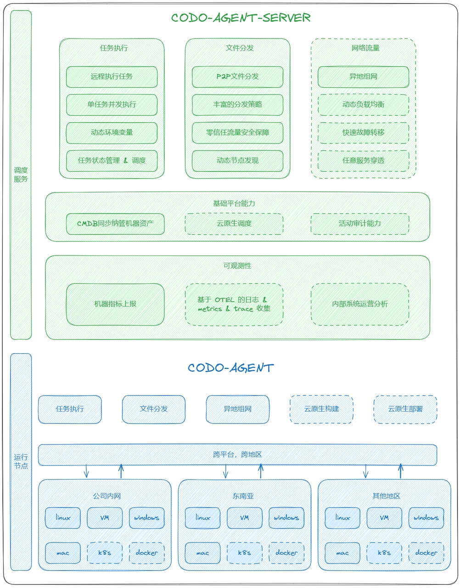

# codo-agent-server
暂时只开放二进制文件，star 过万再开源

## 简介
本系统是 CoDo 平台的核心底层系统，作为 CoDo 服务体系与底层资源设施的连接器，支撑其他服务。它提供任务执行、文件传输、数据传输（包括指标采集、日志采集、链路采集和链路降采样）、代码仓库等基础能力。通过天门网关服务能力，向上层平台或 SaaS 提供服务，实现多种场景的赋能。
本系统已在多家知名游戏公司和国企中广泛应用多年，表现出安全、稳定、可靠和可控的特点。它不仅作为整个 CI/CD 流水线的基础支持，还承接底层网络和异地组网的功能，能够支持多种系统和平台，在不同地域和云厂商之间组网。目前，该系统已经成功覆盖了 CI/CD 流程中的所有构建服务器及线上线下的服务器。
## 架构图


## 参考文档
- [Agent安装文档](./安装文档.md)
- [更新日志](./更新日志.md)


## 服务端部署
## 服务端配置文件  `conf.yaml`
切记只有WS端口可以对外
- [服务端配置文件](./conf.yaml)
## 初始化
```
create database `codo_agent_server` default character set utf8mb4 collate utf8mb4_unicode_ci;
codo-agent-server --config-file=config.yaml migrate  
```

## 启动 server
```
codo-agent-server   --config-file=config.yaml
```
## 启动 proxy  （可选）
```
codo-agent --url ws://127.0.0.1:9999/api/v1/codo/agent?clientId=8888 -s --log-dir /data/logs/codo  --client-type master
```
## 启动 agent
```
# 直连
codo-agent --url ws://127.0.0.1:9999/api/v1/codo/agent?clientId=codo-test -s --log-dir /data/logs/codo --row-limit 2000 --client-type normal
# 代理
codo-agent --url ws://127.0.0.1:20800/api/v1/codo/agent?clientId=codo-test:8888 -s --log-dir /data/logs/codo --row-limit 2000 --client-type normal
```