# Agent安装说明
## 安装脚本及命令
- 建立codoagent目录（位置随意）
  
```bash
cd /d
mkdir codoagent
cd codoagent
```
- 在目录下执行以下命令，初始化安装脚本
  
```bash
curl -O https://ops-public.huanle.com/agent/agent.py
sudo python3 agent.py
```
- 编辑agent_config.json 
```
agent_id: 是机器在codo和行云上使用的名字，全局唯一。
biz_id:  在这里可以找到
```


```bash
# agent_config.json 字段解释
{
    # id 必填, 不可重复
    "agent_id": "None",
    # 业务id 必填, 填自己的业务id
    "biz_id": "None",
    # 别名 可选, 在行云上展示的中文样式, 默认 = id
    "alias": "None",
    # 服务注册地址 可选, 默认为公司内codo
    "agent_server": "wss://codo-proxy-intra.xxxx.com:20801",
    # ssh登录, 如果需要本地ssh启动agent，则需要填入用户名
    "ssh_username": "None",
    # 上面的用户名对应的密码
    "ssh_password": "None",
    # 服务名称, 可选, 默认为codo-agent-{id}
    "serviced_name": "None",
    # 安装版本, 默认为最新线上稳定版本, 如果需要指定版本可填入如: v1.3.26
    "preview_version": "None",
    # 杀死子进程, 将这个设置为 "true", 会开启一个特性,终止进程时可以杀死所有子进程
    "force_kill_sub_proc": "None"
}
```

- 安装agent
  
windows需要管理员（mac和linux需要加sudo）运行以下命令，如果显示以下字样则说明安装成功

```bash
sudo python3 agent.py install
```


- 其他agent维护命令
  


#### Windows问题排查

检查进程是否开启:  `tasklist | findstr "codo"`

#### 守护进程排查思路

- windows的守护进程是基于windows服务功能的。
- 可以通过 win+r 输入 services.msc 打开服务
- 调整服务设置
win+r 输入 services.msc 打开服务，找到注册的codo-agent服务, 确认agent运行状态
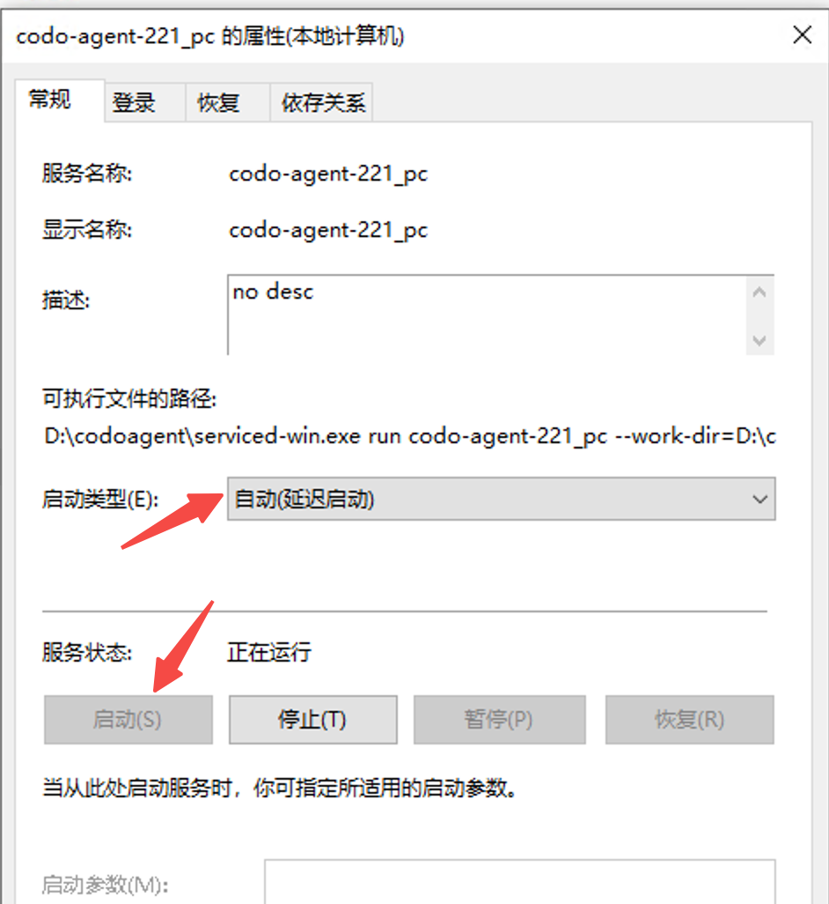
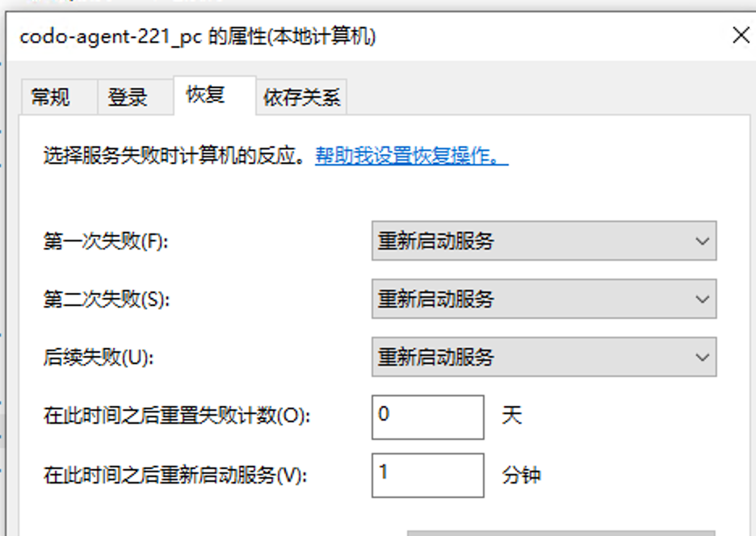
- 一个启动失败的排查思路，将这一串复制到命令行里执行，观察为什么执行不成功
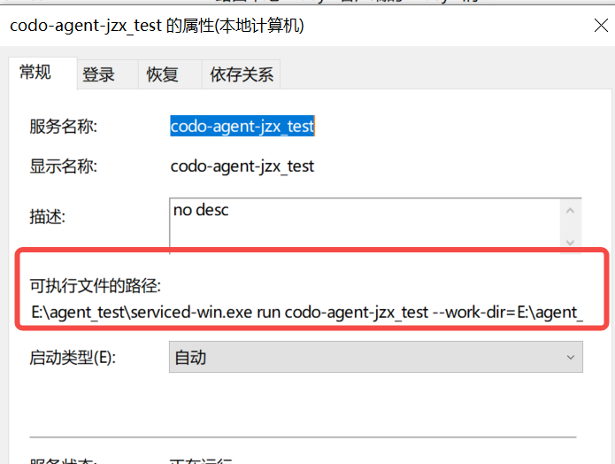
- 检查进程是否启动  `tasklist | findstr "codo"`
- 杀死进程 `taskkill /F /PID 24432`

#### windows开启ssh server

- 在命令行输入这个命令ssh连接本机，如果成功执行就说明已经安装好了，可以跳过这一步
  
```bash
 ssh rowork@127.0.0.1 -p 22
```

- 先打开设置里的开发者选项
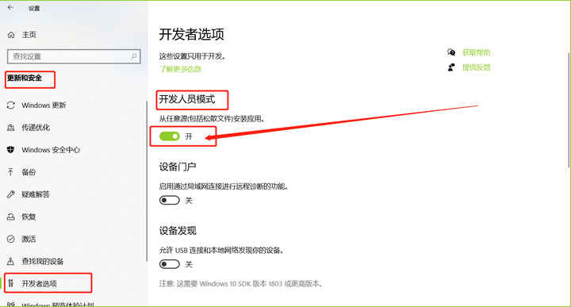
- 开始 → 设置 → 应用 →可选功能，确保已经装好OpenSSH服务器，一般来说默认安装OpenSSH客户端。如果没有安装，则需要在“添加功能”里搜到并安装。
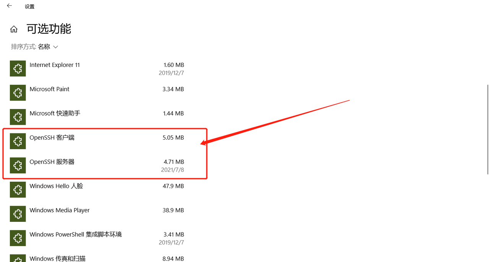
- win+r 输入 services.msc 打开windows服务列表，确认OpenSSH SSH Server服务打开，并调整服务设置
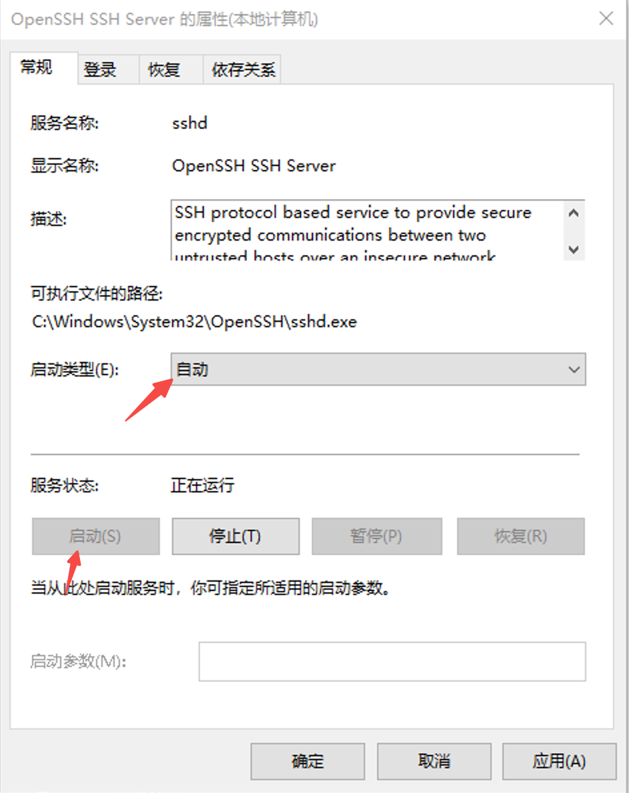
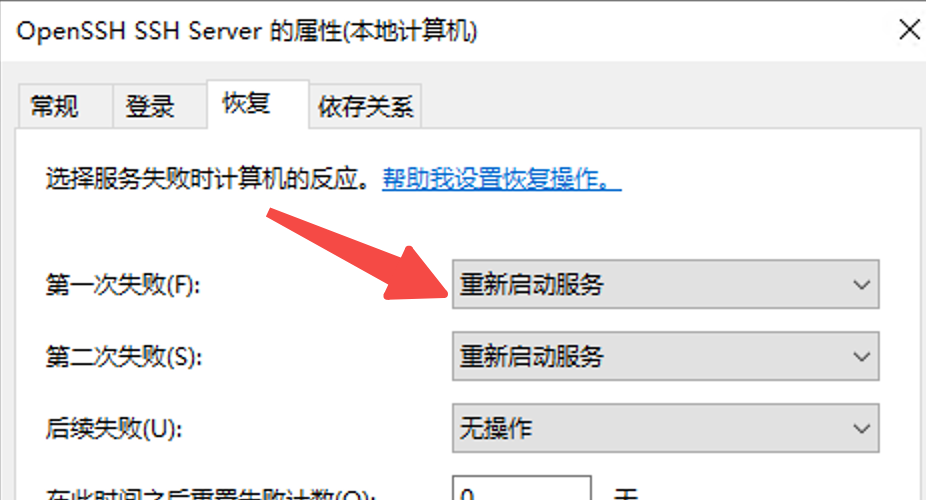
- 下述命令可以执行无问题后，进行下一步
  
```bash
 ssh {username}@127.0.0.1 -p 22
```

#### windows安装python

- 下载地址，最好版本高于3.7
此处应有一个压缩包
- 可以安装到这个目录，便于后续维护，并勾选添加PATH
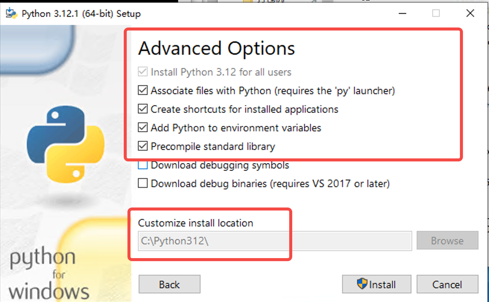
- 如果你想同时拥有python或者python3命令, 可以将python.exe复制一份为python3.exe
- 如果你不想影响原有的python命令(比如python2),可以将python.exe重命名为python3.exe
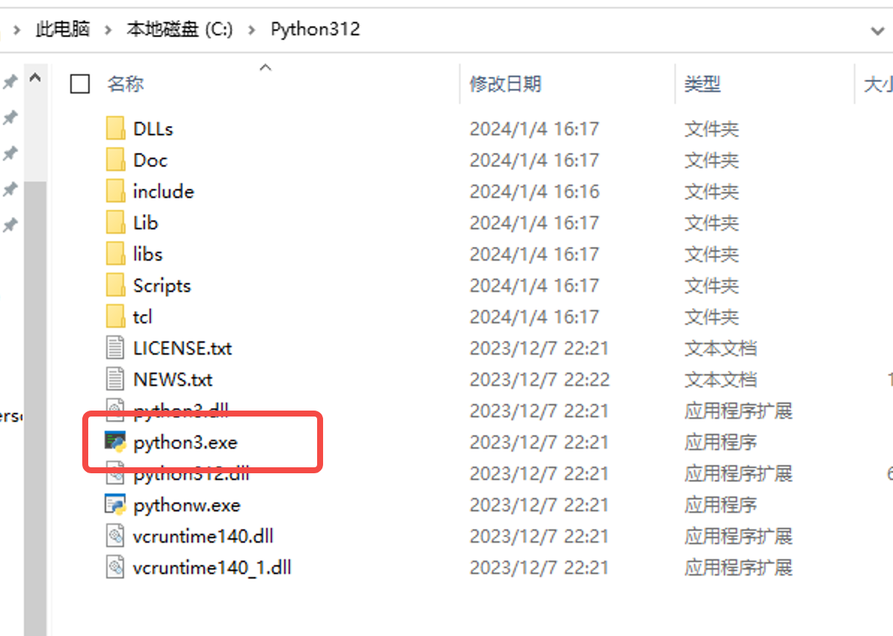

## Mac问题排查

检查是否成功启动 ps -ef | grep codo
macos开启ssh server
- 在命令行输入这个命令ssh连接本机，如果能用就说明已经安装好了。（jenkins是机器的用户名，根据实际情况替换）
  
```bash
 ssh jenkins@127.0.0.1 -p 22
```

- 如果没开ssh，开启本机ssh需要在 设置 - 共享 里打开以下选项：
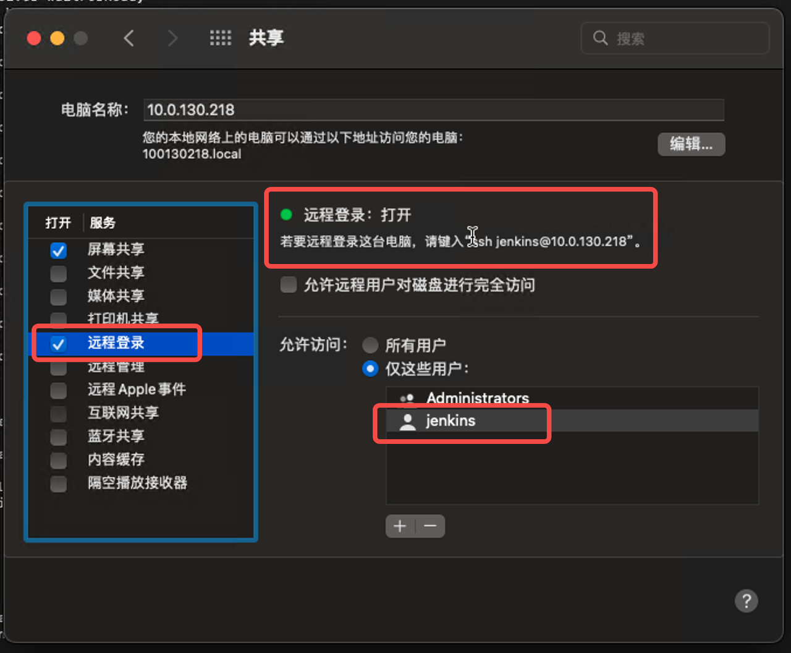

#### macos处理环境变量问题

mac的默认ssh不加载默认环境变量，为了保证PATH和实际环境一致给  `.bashrc` 文件加上两行

```bash
source /etc/profile
source ~/.bash_profile
```

#### 守护进程排查思路

macos的守护进程是基于 launchctl 的。

- 检查是否成功启动 `ps -ef | grep codo`
- 访问 /Library/LaunchDaemons/{服务名}.plist 可以看到 launchctl 的注册详情
- 查看对应的log文件检查启动为什么失败
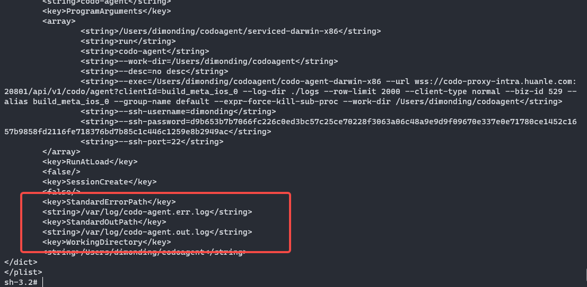
- 本地debug启动服务:  launchctl debug system/codo-agent --stdout --stderr

#### Linux问题排查

检查是否成功启动 ps -ef | grep codo

#### 守护进程排查思路 

linux的守护进程是基于 systemctl的
服务注册文件位于: /etc/systemd/system/
查看当前服务状态:  systemctl status codo-agent

#### selinux限制

sestatus
ausearch -m avc -ts recent | audit2why